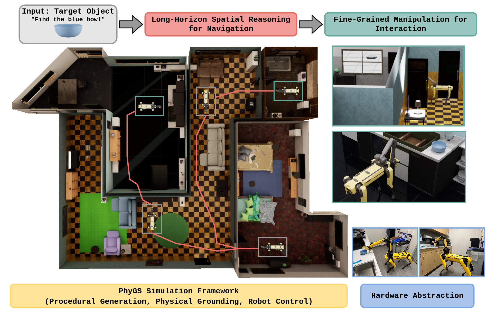

# ForageBench: A Photorealistic, Physically Grounded Benchmark for Interactive Object Search

[](https://m-and-m-lab.github.io/ForageBench/assets/papers/foragebench.pdf)
[](https://m-and-m-lab.github.io/ForageBench/)
[](https://developer.nvidia.com/isaac/sim)
[](LICENSE)

[Aparajito Saha](https://aparajitosaha.github.io)<sup>1</sup>, [Zhen Hao Gan](https://ganzh6880.github.io)<sup>1</sup>, Jinjia Guo<sup>1</sup>, Jacob Skwirsk<sup>1</sup>, Jeremy Acheampong<sup>1</sup>, [Anton Arapin](https://anton-arapin.github.io)<sup>1</sup>, [Chahyon Ku](https://chahyon-ku.github.io)<sup>1</sup>, [Yue Hu](https://phyllish.github.io)<sup>1</sup>, [Nima Fazeli](https://www.mmintlab.com/people/nima-fazeli/)<sup>1</sup>, [Bernadette Bucher](https://bucherb.github.io)<sup>1</sup>

<sup>1</sup>University of Michigan, Ann Arbor

**[Project page](https://m-and-m-lab.github.io/ForageBench)** &nbsp;·&nbsp; **[Paper](https://m-and-m-lab.github.io/ForageBench/assets/papers/foragebench.pdf)**

ForageBench is a simulation benchmark for evaluating methods focused on interactive semantic object search in indoor environments. ForageBench combines visual fidelity alongside physics in interactable household scenes for allowing mobile manipulators such as the Boston Dynamics Spot with Arm to combine spatial, semantic and geometric reasoning for locating target objects. The benchmark builds upon the PhyGS simulation framework for sourcing simulation scenes and implementing an agent stack and hardware abstraction layer for the Boston Dynamics Spot with Arm.

<p align="center">
  
</p>

## 📄 Abstract

Interactive semantic object search is the task of locating and retrieving a target object in an unseen, house-scale environment. This task requires both long-horizon spatial reasoning for navigation and fine-grained skills for manipulation, often demanding that an agent physically interact with the environment to make an occluded target perceivable. Prior benchmarks have largely isolated one capability or the other; we present ForageBench, a benchmark designed to study them jointly on a mobile manipulator developed in our newly introduced simulation framework PhyGS. PhyGS integrates large-scale procedural scene generation with photorealism, physical grounding, and low-level robotic control. Using PhyGS, we build an evaluation dataset of 25 house-scale scenes and 100 episodes spanning a progression of difficulty, and benchmark state-of-the-art vision-language models acting as high-level skill orchestrators. Our best baseline on a simulated Boston Dynamics Spot with Arm achieves an interactive search success of 4\%. PhyGS provides a hardware-abstracted interface mirroring Spot's SDK for development transfer between and simulation and the physical robot. 

## ⚠️ Note on usage

ForageBench is under active development at the [Mapping and Motion Lab](https://sites.google.com/umich.edu/mandmlab/), and this version of the repository is a beta release intended for early community testing and usage. Please file a GitHub issue detailing any bugs faced or major feature requests, and the team will respond to and resolve these issues as soon as possible. 

## 📦 What's in this repository

1. Environment and installation information in `docs/install/`
2. Task definitions and metadata in `tasks/`
3. Helper scripts in `scenes/` to pull released benchmark scenes into the environment for evaluation
4. Agent skill orchestration scripts in `agent/`
5. Evaluation scripts and post-episode-completion metric reporting from IsaacLab in `eval/`

The repository is configured to run in an IsaacLab 2.3 Docker container, please see the installation instructions for more details.

## 🛠️ Installation

ForageBench is installed within the official IsaacLab 2.3 Docker container containing IsaacSim 5.1. Please follow the default instructions for installing the docker container, and then follow the step-by-step instructions that live under [`docs/install/`](docs/install/).

Note that ForageBench uses git submodules for [AO-Grasp + Contact-GraspNet](https://github.com/m-and-m-lab/ao-grasp) and [cuRobo](https://github.com/m-and-m-lab/curobo). Clone recursively, or initialize after the fact:

```bash
git clone --recursive https://github.com/m-and-m-lab/ForageBench.git
# Or, on an existing checkout:
git submodule update --init --recursive
```

## 📝 Citation

If you use ForageBench in your research, please cite:

```bibtex
@misc{2026foragebench,
  title     = {ForageBench: A Photorealistic, Physically Grounded Benchmark for Interactive Object Search},
  author    = {Saha, Aparajito and Gan, Zhen Hao and Guo, Jinjia and
               Skwirsk, Jacob and Acheampong, Jeremy and Arapin, Anton and
               Ku, Chahyon and Hu, Yue and Fazeli, Nima and Bucher, Bernadette},
  year      = {2026}
}
```

## 🙏 Acknowledgments

ForageBench builds on a number of open-source projects, including: 
[Infinigen / Infinigen-Indoors](https://github.com/princeton-vl/infinigen),
[NVIDIA IsaacSim](https://developer.nvidia.com/isaac/sim),
[IsaacLab](https://github.com/isaac-sim/IsaacLab),
[Objaverse-XL](https://objaverse.allenai.org/),
[cuRobo](https://curobo.org/), 
[VLFM](https://naoki.io/portfolio/vlfm.html), 
[AOGrasp](https://stanford-iprl-lab.github.io/ao-grasp/). 

We thank the authors and maintainers of these tools. Please refer to each project's license and cite them as appropriate.